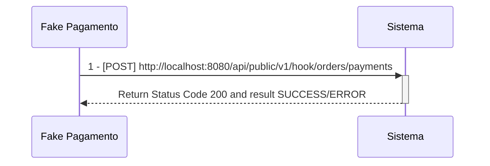

# Tech Challenge - Fase 4: Microsserviço de Pagamentos

## Responsabilidade :triangular_flag_on_post:

Este microsserviço tem a responsabilidade de receber o evento (menssageria via rabitmq) de pedido realizado, para iniciar o fluxo de pagamentos.
Após a criação do registro inicial de pagamentos, o microsserviço aguarda o recebimento do webhook realizado pelo gateway de pagamentos parceiro para atualização das informações e status.

## Equipe :construction_worker:

- Myller Lobo
- Jean Carlos
- Caio Isikawa
- Vanderly
- Thiago

## Pré-Requisitos :exclamation:

- Dotnet 9
- MongoDb
- Docker Desktop
- Rider/Vscode/Visual Studio
- Postman
- k6

---

1 - **Pagamento do Pedido**

---

[Clique aqui para ser redirecionado para a documentação das APIs dos microsserviços e suas funcionalidades](https://documenter.getpostman.com/view/37556926/2sA3s1oXsw)

## Desenho de Arquitetura/Infraestrutura  proposto  :heavy_check_mark:

[Clique aqui para ser redirecionado para o desenho de arquitetura e infraestrutura](https://viewer.diagrams.net/?tags=%7B%7D&lightbox=1&highlight=0000ff&edit=_blank&layers=1&nav=1&title=tc-backend.drawio.png#R%3Cmxfile%20scale%3D%221%22%20border%3D%220%22%3E%3Cdiagram%20name%3D%22Draft%22%20id%3D%22jiXIkiBsy346j2COqR-b%22%3E7V1bd5u4Fv41Wat9gIUE2ObRceKmp%2BlMmnSmM09ZGBSbCUYeLrnMr58tcTFCIrYTiD09TprUbAQI7W9ftaWcmJPl06fYXS2%2BUp%2BEJ9jwn07MsxOMByNjCP8xynNOwUPLzCnzOPBzmrEm3AT%2FkJyISmoW%2BCQpaDkppTRMg5VI9GgUES8VaG4c00ex2R0NfYGwcudE6AYj3HhuSKRmPwI%2FXeTUER6u6RckmC%2FKJ6OBk59ZumXj4sbJwvXpY41knp%2BYk5jSNP%2B0fJqQkI2eOC7TlrNVx2ISpdtcQMZfL77dnDqzp%2BzyIpo4%2F0TGX5pd3ObBDbPijYveps%2FlEMQ0i3zC7mKcmKePiyAlNyvXY2cfgetAW6TLEI4QfEzSmN6TCQ1pDJSIRtDsVO5q%2BVgSp%2BSpRiq6%2FonQJUnjZ2hSnNVsq%2BhZgSTNtAoePK75gofmICcuakzBaFhQ3QIN8%2Br%2B6wGDD8WY7TB%2BZR%2B2Gz82QG7sFShHbDh9N1lUY3sXhGE5dCfYnNrsuxrUEn8mUOahmyTlVTRKa1flXxIr4MyAf7GrY9cPyPqqDtlkmabAJoRMmUu2bctcQgPb6YtLO6H8JS6hBpeKkZMZJA2%2Bwb8Kdt0Uz1UI8c5DXmK7GPAhdqQBR1Z52%2FqAO6NRT%2BNtDqXhJT6o1eKQxumCzmnkhudr6qmoZtZtLildFSP%2FF0nT54IvbpZSleqpM%2BEupI%2FjKABVHNCoaNU64gnNYo%2B88Fa4AG3qxnOSvvT6BUfYO7%2FIwZiE0LUH0dR0zo2y39ujf4OOj2lajqgjSccGXSXLTgci4DiOjkQxQPCtl2qmJgqWbepDR2EjHFvvTR6cwxCH10Pf7hrQxaVXNICuVHxEJhJtPFB0W7xLLn3FhQ2%2BVD15Pat2kpUt%2FKGGSb%2Bz2ferjPYGKevCeJuSj2XIEgSCpTDeI7Mv7bWZIeBZr9hHUPQMn%2FXhZy8fgDc%2FDoM501cpE56KeunOSHhFk6DQZjOapnQJDUJ24tT17uec2XUG8i9owh82TlZ50MGQ4JYHd8ETY9Rp0Z%2BzRZqyaGXMBgJPPT%2By9ADilbsAYBTrHjwRT303deE%2FRk%2FYOAWZNguhA1pCvcAN2TBMB%2BDgT%2BdBushmGsIjfRXN%2B4OCPWxAASuUqcLZtvpytU0JCJ%2BC9CKbAW3sMQYmEjDgZVMRD26BAw%2BGhsQKgCwD3%2Bf6VyXXouRzRy7Xvlh27HpjTMPQaeDxyTJqWDJnTKMnzli7i%2BhrJdAnd24Wpq2SrZZBQUzVUvkADWicEHJfCOTjSgNZTBmn8DRbhdT1mWBiAwMQpwaY9GmOP61An3YJBlr7nd9HTx7mWr%2FyadpNGMjhMEIKt78ido6DgYSDyWe40QQ%2BGVfBioQBOHz%2FFzLatKPIHm1nR3uT0S3yFCvmU%2FHn2qfwz9AZxCYG%2F7GhwYQTnREj6CxxVKPzI32IGo0H8NhJg5i3dGwFdVAR4d8WSiK5J6m3KFi90epLukECGh8BEp8%2FkHwgOEIKzbV8mrMUp%2B4FiUeRo2cJv6Th3xmGbQxlP641TdAB2hzkNMA2sGRNYKkyLpbdE9rK7G0NbtdkHsD7g5NjfGYaGHSsEVH4NQGRdEEzxPC5aPS8Dy3Ru1ZwGnzCA9lwI0dhuK2%2BlEJpCQStMODmFdyqwTzlb54T2BgJPBn8ndHyhJZwHQu21IBResovK86XNzqj3j1n8sVv1U2h1%2Fl9xWcBufb8%2F7q3b2z09gsff0n8wIWYlzlvU2xVJ275iVvhIARn49bnQ9p3LIDMUQO4o4EMXDxSKBjcV0altJ0K5L4ZqL8l2cnEPBmjOKAJc13Y0el4FgK7kg3I9YOHNz27s5f48IOACE2%2F05Rp2ulXOgvgThAqrVYfN0sff40W%2BfsJVPFoIE5SaEjOmeMyAK4DurSs3eN5LxlzVX5cNZXhxumYzaXWPRmgTQP2kvzhrUzZmCxHnSfL1blFyxADpkE5SVHeIk%2BC9pZYRKoouSNhl4z252gek4Qpr69uBGbJV1vW%2F4Yqk97uEmJxuAD0jht5zKXY%2Bd02qDghrmiGRYqYCKsCJRVtKBOR3EyOmfInNIkq2lAmopYYDKtCMBVtaMs9bl6NFFejxtU8qKNZyvIAk6peQzGFDd9TJlrN6Or8bIj4HKqUJa8cNWE%2BfaPn1xIoNu1ZXWWuEwrgg4j2SukWNuNH9zGxdBBOrm0%2Be6w%2Fp3CYfxJbgcJLoHu3LPd0O%2BNoD%2Fpz80xzqDc8PaucOK87eqoKi4rYvWG092EYYRTj5z%2FY9bpdHv5Z3I4fnD0JR8%2F1oysSB%2FDyDDlnhpJbartbs7IemzINvIah3Xr6%2Bo9fYtu9%2FjL5BT3%2F9WN2%2Bcf5n%2BaszJ9vNshW1wb5bQA4kMnTPni2mRej93KOxNkehIzGPfr2juTc8Tt4Rzv4DQ0Iymq%2BJRUp2CMe%2FiRi%2BPNKG9WwjHg0tM%2Fxi5ZRSu8ahp1nXc2GD1EY%2BGbiV0lVpoidlhsP%2BdW642zhyOBRoy33HprW9D6bkTgCZZvwJAsbgVVc2NJebaWYy3Owow%2FlFH%2BLrYQX7stcYuswtGXNgFrDyqIyE4p0A1UtdjGj3RZzlZp1owrGnde%2BvM0cjt5RUd6Q%2BCGAYSzpcZVdclcrLfW0mevdk8jXEqwlD97Ho0b9uTUq8Pi9NCrCQ7lweA%2F6VJ7I6k%2FcZKFarNyjTP2UMrUm8SEt%2BFBJGmN8X9M5eCRWWSK7nK7dr6i952Tk1a9niWzW2imvmag8St%2FBSl8lZyvq9yZnyB7pRqMq3bQPQtRUs6dH9B7RuwG9GCsm%2Ft8fvXIl8BG9R%2FRuRm%2B57me%2F6G3PdLbNuL4YOuzgBBmzqsZJ83IEsvNBBJh2Q%2BWD5JDEJ6sNIclLM6tHuTxYudwQkQDfQ%2FqsFFhpvrQvCTYUC%2Fr2IMHtKTjAaPSmuOSa%2FJ0FScDrz4a87swmrIzj4vv3qw839QRb%2FqgDqtFq1DrXBW29aqMXbW%2BNRJxoyFQtOn%2FPei6zPZjtACMgwwwUPivou6YpcZcweLQVHDXrIpLe3JUP1zRL2TwL9CMLSdIO0AMsLawtY35p84XtVmoWqN%2B0FLq3jRdwqRqrGVxLXgVgYrtcTitsBNBXfbmp8tQ7gt5k4S5dny0n8HmVLrgnhaVmddfvLgnXJKUxX8%2BQd8d3faFY%2BCgN7ykNg8bqOIQdq3II9ikQ7UWgHSDQD2LiAQtLc8DG0OUOPq934OsZYxqGfBUGX%2BlUABZ%2Bfam8Pzj4cP7lUH2NnwqmqFGHPigz8zWI2gbmJZTvh9EOS3FaIs54PvuA2eKzCWtc%2B%2FBRiezx0v2HMuG4PrvZdupLiCt3qjltYXd7gNgMKcsbbVWKWolCU0aqOPalalSV%2FNQrVJXeOjTnpTF5cb%2BqPHUVUz%2Fz0qI6tQoBxRJWP%2BnLn0eO1ShHwwrBqBwcIfDrbacvs8eo79cVAUXdjPm4e08SLw74YrGQBGnG9TnX2uMfN6VEGBr8AKZSpuZvvl0eNXf%2FmttuVkyaiknU93YvLJV78ZJiPK5tOK5t2NPahvv%2BzIdRXlNuiadYxlAalLpclrTu5VLeVSpX3%2BBnw%2B9JmCWMGXvQzzm3LfUyhQ54YSIxEBvaWDbkDjJUanLYm5pUmfLG2AuyVi91lSFv6l5IM19l00a2%2BcJ%2Bm8Iz%2BtlzwDbEsjpLsQ%2BJgxV%2B1Ki3vTgPeD1H64i%2FcoO8LcqLc0%2B38wUd2kDkO26udm3ZRm8cx%2B5zrVmZUmt9DjbF3HuRZJlu2S%2BxOXzIO9Dp2hK7vYbzzZ77WT4rho3P0V3sEoBZljvph%2BiB73ueRjMHli7aA021MVJfMzXWw5fb8MJPR5F96S6%2B4eT7cqr1UHWI7Ba0JMSLSaooPASyD%2BMauGGiscD6WHX4M86wr%2BvoOQ66cHURaoSh1shQJbptrBuKDVrsDlws5WJTvNnDOi7jld2FV61kwrKroeRJP0tHm3uplPu9b1g4qliCikVPFW3nsbzCS1CPzoGsnBO3mn9vhLUDZwuADd4IsDdpHJUdb%2FBTmZ7pO6miDBjdVXA7d1PyyHzdpsU8c8YsY7EhfSkZCQVv28NysAejpuVQRObGSMeKyByhvuxGjwUD46vPcPpTMeoH6aAfWor8bRjDqNpRv4xCVdM4A4W334xWO8OXam7zYLVE6C5nvnt7l0Ve%2FgRlgsnqlYuOJbIQmSNdUYSJVXNxTQveGRd7nIq7dJfRjJcVjTN4u6Oa6FtNOHjQyAng4b61BOrRDP0OyOD4AoYnCa8VA28AurnK2A6TeyhdOw3p3xkJxD7B84tuxcED2MxjKdue5MO2GkXwij97ZiKFdHQxy6yWjv1uySXsJlIL7N8Wy28Mu7aPp7bcYavzSBwZpVv%2BXHpgjWKYllh816S%2F9KBylqmrNL4adu11ad0UEzO11yglZle9f1H9J8LLfP734%2FvHyjpQl7sj0xRwG%2B2ojHvsamXNXurs9IG3OhqR%2FRkRLCbpLEv24a1ym3lxB%2B%2Fd%2F64THK7%2Fqmku%2Fes%2FDmue%2Fws%3D%3C%2Fdiagram%3E%3C%2Fmxfile%3E)

## Documentação do Kubernetes

[Clique Aqui para ser redirecionado](https://github.com/fiap-8soat-tc-one/tc-backend-s3-k8s-iac/blob/main/README.md)
